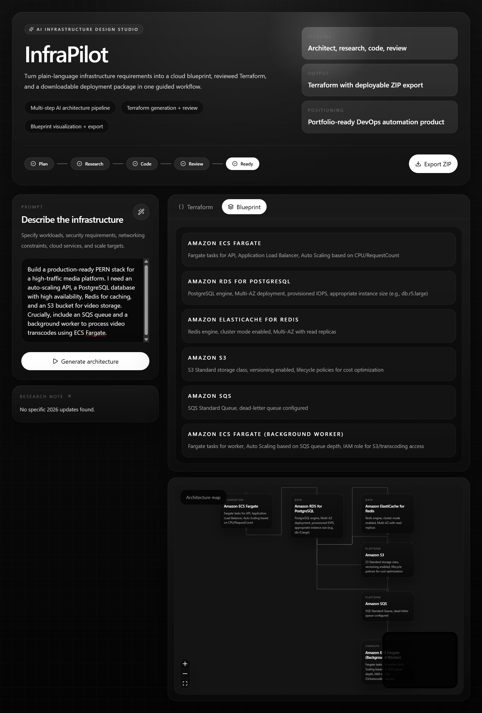
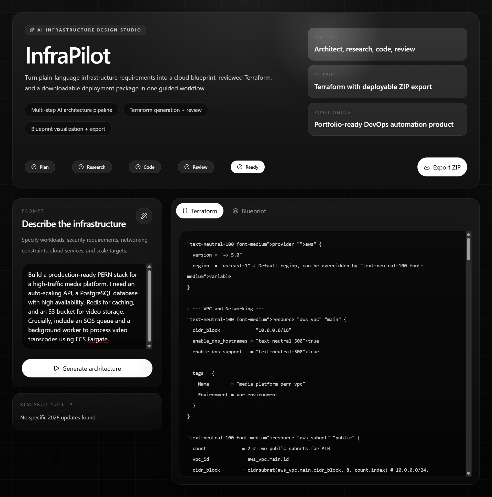

<div align="center">

# 🧭 InfraPilot

### AI-Powered Cloud Infrastructure Generator

**Describe your infrastructure in plain English. Get production-ready Terraform code in seconds.**

[](https://www.linkedin.com/in/alikhan-devs/)
[](https://github.com/AliKhan-Devs)
[](LICENSE)


</div>

---

## 🧠 The Problem

Writing Terraform for AWS requires knowing resource names, provider versions, which arguments are deprecated, and how services fit together. A developer who knows *what* they want to build often spends hours translating that intent into valid infrastructure-as-code.

**InfraPilot removes that translation layer.** You type your requirements in plain English. A 4-node LangGraph agent pipeline — powered by Gemini 2.5 Flash — designs the architecture, researches live AWS best practices via Tavily, generates Terraform HCL, reviews it for errors, and returns a downloadable ZIP ready to run with `terraform apply`.

---

## 📺 Demo

> 🎬 **[Watch the full walkthrough on LinkedIn](https://www.linkedin.com/in/alikhan-devs/)** — covers the complete flow from natural language prompt to downloadable Terraform bundle, with live node tracking and the ReactFlow architecture diagram.

<div align="center">





</div>

---

## ⚙️ The 4-Node Agent Pipeline

InfraPilot runs your prompt through a **LangGraph `StateGraph`** — a stateful pipeline where each node has one focused job, and shared state (`messages`, `blueprint`, `generatedCode`, `errors`) flows through every node automatically.

```
User Prompt (plain English)
        │
        ▼
┌──────────────────────────────────────────────────────────────┐
│  Node 1 — architect                                           │
│                                                               │
│  Role: Senior AWS Solutions Architect                         │
│  Input: state.messages (user's prompt)                        │
│  How: model.withStructuredOutput(BlueprintSchema) forces      │
│       Gemini to return valid JSON matching a Zod schema —     │
│       no free-form text, no hallucinated formats              │
│  Output: blueprint → { projectName, services[],              │
│          infrastructureType, needsVPC }                       │
│  Socket: io.emit('node_start', { node: 'architecting' })      │
└───────────────────────┬──────────────────────────────────────┘
                        │  structured blueprint JSON
                        ▼
┌──────────────────────────────────────────────────────────────┐
│  Node 2 — researcher                                          │
│                                                               │
│  Role: Live AWS Best Practices Researcher                     │
│  Input: blueprint.services[1] (primary service)               │
│  How: Tavily Search → "Latest AWS best practices for          │
│       {service} in 2026" → Gemini summarizes the results      │
│  Output: blueprint.researchNote appended to existing state    │
│  Fallback: If Tavily fails, graph continues — never breaks    │
│  Socket: io.emit('node_start', { node: 'researching' })       │
└───────────────────────┬──────────────────────────────────────┘
                        │  blueprint + researchNote
                        ▼
┌──────────────────────────────────────────────────────────────┐
│  Node 3 — coder                                               │
│                                                               │
│  Role: Expert DevOps Engineer                                 │
│  Input: projectName, infrastructureType, services,            │
│         researchNote                                          │
│  How: AWS Provider 5.0+, VPC/Subnet/SG definitions,          │
│       variables for sensitive data. temperature: 0 for        │
│       deterministic, predictable output                       │
│  Output: generatedCode (complete .tf content string)          │
│  Socket: io.emit('node_start', { node: 'coding' })            │
└───────────────────────┬──────────────────────────────────────┘
                        │  generatedCode
                        ▼
┌──────────────────────────────────────────────────────────────┐
│  Node 4 — reviewer                                            │
│                                                               │
│  Role: Terraform Code Reviewer                                │
│  Input: generatedCode from coder node                         │
│  How: Reviews for deprecated arguments, unsupported           │
│       resource types, provider version mismatches             │
│  Output: errors / corrections → returned as securityReview    │
└──────────────────────────────────────────────────────────────┘
                        │
                        ▼
          Final API Response to Frontend:
          {
            blueprint,       ← full plan + research note
            terraformCode,   ← reviewed, corrected .tf code
            securityReview,  ← reviewer's findings
            history          ← full message trace
          }
```

**Why 4 separate nodes instead of one big prompt?**

Each node is given a single, focused role with a targeted system prompt. The `architect` uses `withStructuredOutput(BlueprintSchema)` — Gemini is *forced* to return valid JSON matching a Zod schema, making the output machine-readable for the next node. The `researcher` injects *live* 2026 AWS knowledge via Tavily so the Terraform reflects current best practices, not stale training data. The `coder` runs at `temperature: 0` for deterministic output. The `reviewer` catches what the coder missed. None of this is possible in a single prompt.

---

## 🔴 Real-Time Node Tracking

Every node fires a Socket.IO event the moment it starts:

```ts
// architect.ts
io.emit('node_start', { node: 'architecting' })

// researcher.ts
io.emit('node_start', { node: 'researching' })

// coder.ts
io.emit('node_start', { node: 'coding' })
```

The frontend listens to these `node_start` events via Socket.IO client and highlights the currently active node in the UI — you watch each agent activate live, step by step, instead of waiting for a single response.

---

## ✨ Features

| Feature | Description |
|---|---|
| **Natural Language Input** | Describe any AWS infrastructure in plain English |
| **Zod-Validated Blueprint** | Architect forces structured JSON output — no hallucinated formats |
| **Live Web Research** | Researcher queries Tavily for real AWS best practices before writing a line of code |
| **Terraform Code Generation** | Complete HCL with VPC, Subnets, Security Groups, and sensitive data as variables |
| **Automated Code Review** | Reviewer node catches deprecated arguments and provider version mismatches |
| **Real-Time Node Tracking** | Socket.IO `node_start` events show which agent is running live in the frontend |
| **ReactFlow Architecture Diagram** | Visual diagram auto-generated from the architect's blueprint JSON |
| **One-Click ZIP Export** | Download a complete, ready-to-execute Terraform bundle |
| **Graceful Fallback** | Tavily failure never crashes the graph — researcher returns a default note and continues |

---

## 🛠️ Tech Stack

| Layer | Technology | Details |
|---|---|---|
| **LLM** | Google Gemini 2.5 Flash | `temperature: 0`, `maxOutputTokens: 2048`, via `@langchain/google-genai` |
| **Agent Orchestration** | LangGraph `StateGraph` | 4 nodes, linear: `START → architect → researcher → coder → reviewer → END` |
| **Schema Validation** | Zod + `withStructuredOutput` | Architect forces typed blueprint JSON from Gemini |
| **Live Research** | Tavily Search | `@langchain/tavily`, `maxResults: 2`, current AWS best practices |
| **Backend** | Express + TypeScript | REST API, HTTP server, Socket.IO setup |
| **Real-time** | Socket.IO | `node_start` events emitted per node for live UI tracking |
| **Frontend** | React, Vite, Tailwind CSS v4 | Prompt input, Terraform panel, stage progress tracker |
| **Diagrams** | React Flow | Architecture map from architect's blueprint JSON |
| **ZIP Packaging** | JSZip | Bundles Terraform files for download |

---

## 📡 API Reference

### `POST /api/v1/architect`
Triggers the full 4-node pipeline.

**Request:**
```json
{ "prompt": "A containerized Node.js API on ECS Fargate with RDS PostgreSQL and an ALB" }
```

**Response:**
```json
{
  "success": true,
  "blueprint": {
    "projectName": "node-ecs-api",
    "services": [
      { "serviceName": "ECS Fargate", "reasoning": "...", "configHint": "..." },
      { "serviceName": "RDS PostgreSQL", "reasoning": "...", "configHint": "t3.micro" }
    ],
    "infrastructureType": "containerized",
    "needsVPC": true,
    "researchNote": "ECS Fargate 2026 best practices: use Graviton3 instances..."
  },
  "terraformCode": "provider \"aws\" { region = var.aws_region }\n...",
  "securityReview": "No deprecated arguments found. ALB listener rule syntax valid.",
  "history": [...]
}
```

### `POST /api/v1/download-infra`
Packages Terraform output into a downloadable ZIP.

### `GET /health`
```json
{ "status": "Agentic Backend is Running", "timestamp": "2026-03-23T10:00:00.000Z" }
```

---

## ⚙️ Local Setup

### Prerequisites
- Node.js v18+
- Google Gemini API key → [Google AI Studio](https://aistudio.google.com/)
- Tavily API key → [tavily.com](https://tavily.com) (free tier available)

### 1. Clone the repository
```bash
git clone https://github.com/AliKhan-Devs/InfraPilot.git
cd InfraPilot
```

### 2. Configure and start the backend
```bash
cd backend
npm install
```

Create `.env` inside `backend/`:
```env
PORT=5000
GOOGLE_API_KEY=your_gemini_api_key
TAVILY_API_KEY=your_tavily_api_key
```

```bash
npm run dev
```

### 3. Start the frontend
```bash
# New terminal
cd frontend
npm install
npm run dev
```

### 4. Open the app

| Service | URL |
|---|---|
| Frontend | `http://localhost:5173` |
| Backend API | `http://localhost:5000` |
| Health check | `http://localhost:5000/health` |

---

## 🚀 Usage

1. Open `http://localhost:5173`
2. Enter your infrastructure requirement:
   > *"I need a containerized Node.js API on ECS Fargate, an RDS PostgreSQL database, an Application Load Balancer, and an S3 bucket for file storage"*
3. Click **Generate** — watch each of the 4 nodes activate live in the stage tracker
4. Review the Terraform code in the output panel
5. Inspect the auto-generated architecture diagram in React Flow
6. Click **Download ZIP** and run:
   ```bash
   unzip infrapilot-output.zip
   cd output
   terraform init
   terraform plan
   terraform apply
   ```

---

## 📁 Project Structure

```
InfraPilot/
├── backend/
│   └── src/
│       ├── agents/
│       │   ├── nodes/
│       │   │   ├── architect.ts     # Zod schema, withStructuredOutput, blueprint JSON
│       │   │   ├── researcher.ts    # Tavily search + Gemini summary + fallback
│       │   │   ├── coder.ts         # Terraform HCL, AWS Provider 5.0+, temp: 0
│       │   │   └── reviewer.ts      # Deprecated arg detection, security review
│       │   ├── graph.ts             # StateGraph: 4 nodes, linear edges
│       │   ├── state.ts             # AgentState: messages, blueprint, generatedCode, errors
│       │   └── model.ts             # Gemini 2.5 Flash (temp: 0, maxTokens: 2048)
│       ├── controllers/
│       │   ├── agentController.ts   # Invokes graph.invoke(), returns full response
│       │   └── downloadController.ts # ZIP packaging via JSZip
│       ├── routes/
│       │   ├── agentRoutes.ts       # POST /api/v1/architect
│       │   └── downloadRoutes.ts    # POST /api/v1/download-infra
│       ├── socket.ts                # Socket.IO connection + event handler
│       └── server.ts                # Express app, HTTP server, Socket.IO init
│
├── frontend/
│   └── src/
│       ├── components/              # PromptInput, TerraformOutput, ArchitectureMap,
│       │                            # StageProgress (listens to node_start events)
│       ├── App.jsx
│       └── main.jsx
│
└── images/
    ├── 1.png                        # UI screenshot
    └── 2.png                        # Architecture diagram screenshot
```

---

## 🗺️ Roadmap

- [ ] **Multi-cloud support** — Azure and GCP Terraform providers
- [ ] **Terraform module library** — Reusable modules for common patterns (VPC, ECS cluster, RDS)
- [ ] **Infracost integration** — Show estimated monthly AWS cost before applying
- [ ] **Remote state config** — Auto-generate S3 backend configuration in ZIP output
- [ ] **Diagram export** — Download ReactFlow architecture diagram as PNG/SVG
- [ ] **Prompt history** — Save and reload previous generations
- [ ] **Production deployment** — Environment-based API URL config for hosted version

---

## 🔐 Security Notes

- All API keys stored in `.env` only — never committed (`.gitignore` covers this)
- InfraPilot generates code only — it never provisions resources itself
- Reviewer node acts as a safety layer, catching invalid configurations before download

---

## 👨‍💻 Author

**Ali Khan** — Backend Engineer | AI Systems | AWS | Node.js

[](https://www.linkedin.com/in/alikhan-devs/)
[](https://github.com/AliKhan-Devs)
[](mailto:alikhandevs@gmail.com)
[](https://alikhan-devs.vercel.app)

---

<div align="center">

*Built to close the gap between knowing what you want to deploy and actually deploying it.*

⭐ **If this project saved you time or gave you ideas, a star goes a long way.**

</div>
